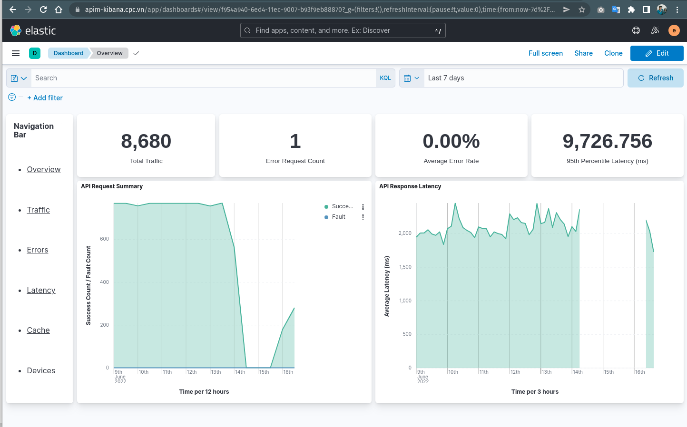

Monitoring ELK
==============

Cài đặt ELK

.. important:: 
    Trước khi cài đặt, hãy xem xét về yêu cầu `hệ thống tối thiểu của APIM <https://apim.docs.wso2.com/en/latest/install-and-setup/install/installation-prerequisites>`_ 
    và :ref:`Hạ tầng đề xuất của CPC-APIM<recommended_hardware>`.

Chuẩn bị cài đặt
----------------

.. code-block:: bash

    #Disable all swap files trên server cài đặt ELK
    sudo swapoff -a

    #Import the Elasticsearch PGP Key, sources.list
    wget -qO - https://artifacts.elastic.co/GPG-KEY-elasticsearch | sudo gpg --dearmor -o /usr/share/keyrings/elasticsearch-keyring.gpg

    sudo apt-get install apt-transport-https

    echo "deb [signed-by=/usr/share/keyrings/elasticsearch-keyring.gpg] https://artifacts.elastic.co/packages/8.x/apt stable main" | sudo tee /etc/apt/sources.list.d/elastic-8.x.list

    sudo apt-get update

Cài đặt Elastic Search
----------------------

**Cài đặt**

.. important::
    Để download được các package từ internet, hãy xem thêm về yêu cầu :ref:`network<recommended_hardware_network>` tại EVNCPC Data Center.

.. note::
    Vào thời điểm hiện tại, CPC-APIM đang cài đặt `Elastic Search 8.2 <https://www.elastic.co/elastic-stack/>`_ .
    Trong tương lai có thể phiên bản Elastic Search khác sẽ được cài đặt.

.. code-block:: bash

    sudo apt install elasticsearch

    #Running Elasticsearch with systemd
    sudo systemctl daemon-reload
    sudo systemctl enable elasticsearch.service
    sudo systemctl start elasticsearch.service
    sudo systemctl stop elasticsearch.service

.. note::
    Tính năng security của elasticsearch được mở mặc định nên sau khi cài đặt sẽ hiển thị mật khẩu và các hướng dẫn thay đổi nếu cần

.. code-block:: bash

     -------Security autoconfiguration information-------

    Authentication and authorization are enabled.
    TLS for the transport and HTTP layers is enabled and configured.

    The generated password for the elastic built-in superuser is : <password>

    If this node should join an existing cluster, you can reconfigure this with
    '/usr/share/elasticsearch/bin/elasticsearch-reconfigure-node --enrollment-token <token-here>'
    after creating an enrollment token on your existing cluster.

    You can complete the following actions at any time:

    Reset the password of the elastic built-in superuser with
    '/usr/share/elasticsearch/bin/elasticsearch-reset-password -u elastic'.

    Generate an enrollment token for Kibana instances with
    '/usr/share/elasticsearch/bin/elasticsearch-create-enrollment-token -s kibana'.

    Generate an enrollment token for Elasticsearch nodes with
    '/usr/share/elasticsearch/bin/elasticsearch-create-enrollment-token -s node'.

.. note::
    Sử dụng lệnh `/usr/share/elasticsearch/bin/elasticsearch-reset-password -u <built-in user>` để generate các mật khẩu cho `user hệ thống <https://www.elastic.co/guide/en/elasticsearch/reference/current/built-in-users.html>`_

Kiểm tra Elasticsearch đang hoạt động

.. code-block:: bash

    curl -u elastic http://localhost:9200
    Enter host password for user 'elastic': <password>
    {
    "name" : "cpc-apim-app08",
    "cluster_name" : "elasticsearch",
    "cluster_uuid" : "hMcrcZ-wSqCFuM9NT6yWwQ",
    "version" : {
        "number" : "8.2.2",
        "build_flavor" : "default",
        "build_type" : "deb",
        "build_hash" : "9876968ef3c745186b94fdabd4483e01499224ef",
        "build_date" : "2022-05-25T15:47:06.259735307Z",
        "build_snapshot" : false,
        "lucene_version" : "9.1.0",
        "minimum_wire_compatibility_version" : "7.17.0",
        "minimum_index_compatibility_version" : "7.0.0"
    },
    "tagline" : "You Know, for Search"
    }

Cấu hình system limit, bổ sung thông tin limit vào file `/etc/security/limits.conf`

.. code-block:: bash
    
    elasticsearch  -  nofile  65535

**Cấu hình Elasticsearch**

File cấu hình của ES tại thư mục `/etc/elasticsearch/elasticsearch.yml`, tham khảo thêm tại `Configuring Elasticsearch <https://www.elastic.co/guide/en/elasticsearch/reference/8.2/settings.html>`_
và `Important Elasticsearch configuration <https://www.elastic.co/guide/en/elasticsearch/reference/8.2/important-settings.html>`_, `Configuring system settings <https://www.elastic.co/guide/en/elasticsearch/reference/8.2/setting-system-settings.html>`_

Sau khi update cấu hình cần thiết ta restart lại service để nhận thông số cấu hình

.. code-block:: bash

    sudo systemctl start elasticsearch.service

Cài đặt Kibana
--------------

.. code-block:: bash

    server.publicBaseUrl: "https://apim-kibana.cpc.vn"
    elasticsearch.hosts: ["http://localhost:9200"]
    elasticsearch.username: "kibana_system"
    elasticsearch.password: "<mật khẩu generate ở trên>"

Restart kibana sau khi cập nhật cấu hình

.. code-block:: bash

    sudo systemctl restart kibana.service

Cài đặt Logstash
----------------

.. code-block:: bash

    sudo apt install logstash

    #Running logstash with systemd
    sudo systemctl start logstash.service

**Cấu hình Logstash**

Cấu hình logstash tại `/etc/logstash/logstash.yaml`

.. code-block:: bash

    xpack.monitoring.elasticsearch.username: logstash_system
    xpack.monitoring.elasticsearch.password: <mật khẩu generate ở trên>

**Cấu hình đọc log từ wso Micro Integrator**

Cấu hình tại `/etc/logstash/conf.d/wso2mi.log.conf`

.. code-block:: bash

    input {
        beats {
            port => 5044
        }
    }
    filter {
        if "apim_metrics" in [tags] {
            grok {
                match => ["message", "%{GREEDYDATA:UNWANTED}\ apimMetrics:%{GREEDYDATA:apimMetrics}\, %{GREEDYDATA:UNWANTED} \:%{GREEDYDATA:properties}"]
            }
            json {
                source => "properties"
            }
        }
    }
    output {
        if "audit" in [tags] {
            elasticsearch {
                hosts => [ "localhost:9200" ]
                index => "audit-log"
                user => "elastic"
                password => "<mật khẩu generate ở trên>"
            }
        }
        if "wso2carbon" in [tags] {
            elasticsearch {
                hosts => [ "localhost:9200" ]
                index => "wso2carbon-log"
                user => "elastic"
                password => "<mật khẩu generate ở trên>"
            }
        }
        if "api" in [tags] {
            elasticsearch {
                hosts => [ "localhost:9200" ]
                index => "api-log"
                user => "elastic"
                password => "<mật khẩu generate ở trên>"
            }
        }
        if "wso2-apigw-errors" in [tags] {
            elasticsearch {
                hosts => [ "localhost:9200" ]
                index => "wso2-apigw-errors-log"
                user => "elastic"
                password => "<mật khẩu generate ở trên>"
            }
        }
        if "correlation" in [tags] {
            elasticsearch {
                hosts => [ "localhost:9200" ]
                index => "correlation-log"
                user => "elastic"
                password => "<mật khẩu generate ở trên>"
            }
        }
        if "apim_metrics" in [tags] {
            if [apimMetrics] == " apim:response" {
                elasticsearch {
                    hosts => ["http://localhost:9200"]
                    index => "apim_event_response"
                    user => "elastic"
                    password => "<mật khẩu generate ở trên>"
                }
            } else if [apimMetrics] == " apim:faulty" {
                elasticsearch {
                    hosts => ["http://localhost:9200"]
                    index => "apim_event_faulty"
                    user => "elastic"
                    password => "<mật khẩu generate ở trên>"
                }
            }    
        }
    }

Cài đặt Filebeat
----------------

Ta cài đặt Filebeat trên các server cần lấy log như server APIM, MI và cấu hình beat đọc log từ các file log gửi đến Logstash trên server Analytics

.. code-block:: bash

    sudo apt install filebeat
    sudo systemctl enable filebeat

Cấu hình Filebeat server APIM `/etc/filebeat/filebeat.yml`

.. code-block:: bash

    filebeat.inputs:
    - type: log
    enabled: true
    paths:
        - /opt/wso2/wso2am-4.1.0/repository/logs/audit.log
    tags: ["audit"]
    - type: log
    enabled: true
    paths:
        - /opt/wso2/wso2am-4.1.0/repository/logs/wso2carbon.log
    tags: ["wso2carbon"]
    - type: log
    enabled: true
    paths:
        - /opt/wso2/wso2am-4.1.0/repository/logs/api.log
    tags: ["api"]
    - type: log
    enabled: true
    paths:
        - /opt/wso2/wso2am-4.1.0/repository/logs/correlation.log
    tags: ["correlation"]
    - type: log
    enabled: true
    paths:
        - /opt/wso2/wso2am-4.1.0/repository/logs/wso2-apigw-errors.log
    tags: ["wso2-apigw-errors"]
    - type: log
    enabled: true
    paths:
        - /opt/wso2/wso2am-4.1.0/repository/logs/apim_metrics.log
    tags: ["apim_metrics"]
    include_lines: ['(apimMetrics):']

    output.logstash:
    # The Logstash hosts
    hosts: ["10.72.120.20:5044"]

Chạy lệnh sau để thực thi beat

.. code-block:: bash

    /usr/share/filebeat/bin/filebeat -c /etc/filebeat/filebeat.yml -path.home /usr/share/filebeat -path.config /etc/filebeat -path.data /var/lib/filebeat -path.logs /var/log/filebeat

hoặc restart filebeat service

.. code-block:: bash
    
    sudo systemctl restart filebeat.service

Bổ sung cấu hình ELK analytics cho server APIM
----------------------------------------------

Điều chỉnh file `<APIM_HOME>/repository/conf/deployment.toml`

.. code-block:: bash

    [apim.analytics]
    enable = true
    type = "elk"

Cấu hình log tại file `<APIM_HOME>/repository/conf/log4j2.properties`

.. code-block:: bash

    #Thêm APIM_METRICS_APPENDER vào danh sách appenders
    appenders = APIM_METRICS_APPENDER, .... 

    appender.APIM_METRICS_APPENDER.type = RollingFile appender.APIM_METRICS_APPENDER.name = APIM_METRICS_APPENDER appender.APIM_METRICS_APPENDER.fileName = ${sys:carbon.home}/repository/logs/apim_metrics.log appender.APIM_METRICS_APPENDER.filePattern = ${sys:carbon.home}/repository/logs/apim_metrics-%d{MM-dd-yyyy}-%i.log appender.APIM_METRICS_APPENDER.layout.type = PatternLayout appender.APIM_METRICS_APPENDER.layout.pattern = %d{HH:mm:ss,SSS} [%X{ip}-%X{host}] [%t] %5p %c{1} %m%n appender.APIM_METRICS_APPENDER.policies.type = Policies appender.APIM_METRICS_APPENDER.policies.time.type = TimeBasedTriggeringPolicy appender.APIM_METRICS_APPENDER.policies.time.interval = 1 appender.APIM_METRICS_APPENDER.policies.time.modulate = true appender.APIM_METRICS_APPENDER.policies.size.type = SizeBasedTriggeringPolicy appender.APIM_METRICS_APPENDER.policies.size.size=1000MB appender.APIM_METRICS_APPENDER.strategy.type = DefaultRolloverStrategy appender.APIM_METRICS_APPENDER.strategy.max = 10

    #Thêm reporter
    loggers = reporter, ...

    logger.reporter.name = org.wso2.am.analytics.publisher.reporter.elk
    logger.reporter.level = INFO
    logger.reporter.additivity = false
    logger.reporter.appenderRef.APIM_METRICS_APPENDER.ref = APIM_METRICS_APPENDER

.. note::

    Tải file cấu hình `Dashboard <https://drive.google.com/file/d/1BWUobyW5x_5_UWSpLHgyAhTO-7Xiuhuw/view?usp=sharing>`_

Cấu hình ELK Dashboard
----------------------

#. Sau khi hoàn tất cấu hình và chạy service, truy cập địa chỉ giao diện Kibana theo đia chỉ http://localhost:5601 hoặc qua domain được cấu hình ví dụ https://apim-kibana.cpc.vn và đăng nhập bằng tài khoản `elastic`
#. Truy cập menu **Stack Management** > **Saved Object** > **Import** và import file dashboard ở trên
#. Truy cập menu Dashboard để xem các thông tin 

