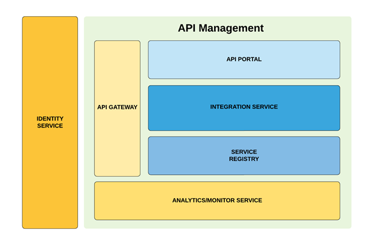
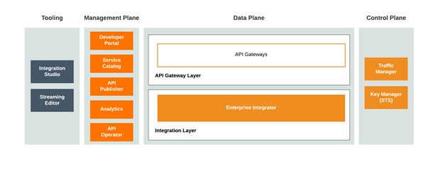
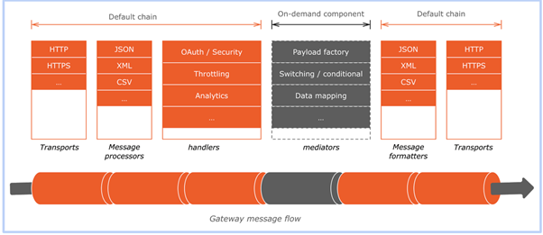
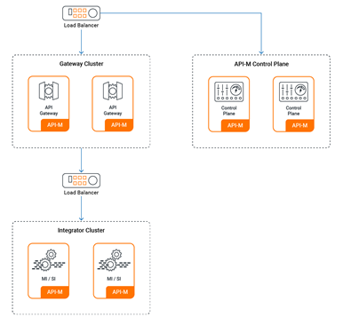

Thành phần cấu thành CPC-APIM
=============================

CPC-APIM gồm các thành phần như sau:

* **API Management (APIM):** Hệ thống quản lý API/WS, cung cấp hệ thống và công cụ giúp cho việc khởi tạo, quản lý, chia sẻ, theo dõi các API.

* **Load Balancer:** thực hiện cân bằng tải, phân phối request đến các server phía sau

* **Identity Service:** dịch vụ xác thực tập trung của hệ thống. Dịch vụ này cung cấp các phương thức xác thực và kết nối xác thực giữa API và đối tượng sử dụng. Dịch vụ này có thể kế thừa từ các dịch vụ xác thực theo chuẩn OAuth2.

* **API Gateway:** cổng giao tiếp

* **API Integrator:** hỗ trợ trong việc tích hợp, chuyển đổi các service và dữ liệu.

* **API Control Plane:** gồm các thành phần chính Publisher, Devportal, Key Manager, Traffic Manager

* **Analytics and Monitoring:** hệ thống phân tích, giám sát các hoạt động chung của APIM

**Mô hình cài đặt CPC-APIM**

